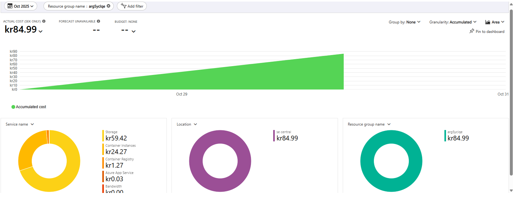
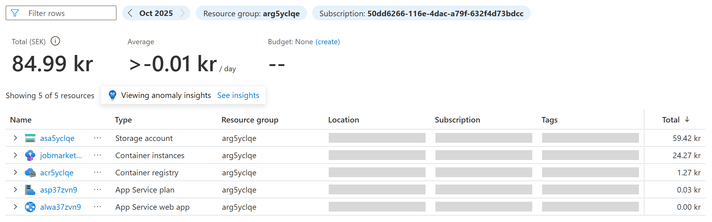
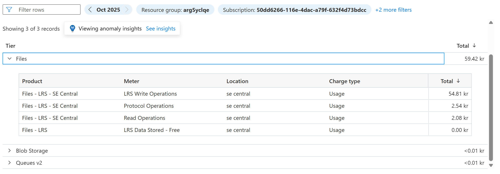

| **Service type**          | **Region**            | **Basic Description**                                                                                                                                                                                                                                                                            | **Basic Estimated monthly cost** | **Generous Description**                                                                                                                                                                                                                                                                         | **Generous Estimated monthly cost** |
| ------------------------- | --------------------- | ------------------------------------------------------------------------------------------------------------------------------------------------------------------------------------------------------------------------------------------------------------------------------------------------ | -------------------------------- | ------------------------------------------------------------------------------------------------------------------------------------------------------------------------------------------------------------------------------------------------------------------------------------------------ | ----------------------------------- |
| Storage Accounts          | Sweden Central        |                                                                                                                                                                                                                                                                                                  | 0.00 SEK                           |                                                                                                                                                                                                                                                                                                  | 0.00 SEK                              |
| Azure Container Registry  | Sweden Central        | Basic Tier, 1 registry x 30 days, 0 GB Extra Storage, Container Build - 1 CPUs x 1 Seconds - Inter Region transfer type, 5 GB outbound data transfer from Sweden Central to East Asia                                                                                                            | 47.12 SEK                          | Basic Tier, 1 registry x 30 days, 0 GB Extra Storage, Container Build - 1 CPUs x 1 Seconds - Inter Region transfer type, 5 GB outbound data transfer from Sweden Central to East Asia                                                                                                            | 47.12 SEK                             |
| Azure Container Instances | Sweden Central        | 1 Container group(s) x 2,592,000 Second(s), Linux OS, Pay as you go, 2 GB Memory, 1 vCPU(s)                                                                                                                                                                                             | 385.67 SEK                         | 1 Container group(s) x 2,592,000 Second(s), Linux OS, Pay as you go, 8 GB Memory, 2 vCPU(s)                                                                                                                                                                                             | 910.09 SEK                            |
| App Service               | Sweden Central        | Basic Tier; 1 B1 (1 Core(s), 1.75 GB RAM, 10 GB Storage) x 30 Days; Linux OS; 0 SNI SSL Connections; 0 IP SSL Connections; 0 Custom Domains; 0 Standard SLL Certificates; 0 Wildcard SSL Certificates                                                                                            | 122.18 SEK                         | Basic Tier; 1 B1 (1 Core(s), 1.75 GB RAM, 10 GB Storage) x 30 Days; Linux OS; 0 SNI SSL Connections; 0 IP SSL Connections; 0 Custom Domains; 0 Standard SLL Certificates; 0 Wildcard SSL Certificates                                                                                            | 122.18 SEK                            |
| Azure Files               | Sweden Central        | HDD (Standard) Media tier, LRS Redundancy, Provisioned v2 Billing model, Provisioned capacity – 256 GiB Provisioned storage, 500 Provisioned IOPS, 66 MiB/sec Provisioned throughput, Used capacity - 0 GiB Overflow used snapshot storage, 0 GiB Used soft-deleted storage, 0 File sync servers | 314.88 SEK                         | HDD (Standard) Media tier, LRS Redundancy, Provisioned v2 Billing model, Provisioned capacity – 256 GiB Provisioned storage, 500 Provisioned IOPS, 66 MiB/sec Provisioned throughput, Used capacity - 0 GiB Overflow used snapshot storage, 0 GiB Used soft-deleted storage, 0 File sync servers | 314.88 SEK                            |
|                           | **Support**           |                                                                                                                                                                                                                                                                                                  | 0.00 SEK                           |                                                                                                                                                                                                                                                                                                  | 0.00 SEK                              |
|                           | **Total**             |                                                                                                                                                                                                                                                                                                  | **869.85 SEK**                     |                                                                                                                                                                                                                                                                                                  | **1,394.26 SEK**                      |

## Cost Analysis & Conclusions

### **Overall Monthly Costs**
- **Basic Configuration**: 869.85 SEK/month (~$80 USD)
- **Generous Configuration**: 1,394.26 SEK/month (~$128 USD)
- **Cost Difference**: 524.41 SEK (60% increase for generous tier)

### **Primary Cost Drivers**
1. **Azure Container Instances** - Most expensive component
   - Basic: 385.67 SEK (44% of total cost)
   - Generous: 910.09 SEK (65% of total cost)
   - Scaling from 1 vCPU/2GB to 2 vCPU/8GB more than doubles the cost

2. **Azure Files** - Second highest cost
   - 314.88 SEK for both tiers (36% of basic, 23% of generous)
   - Fixed cost regardless of configuration tier

3. **App Service** - Moderate cost
   - 122.18 SEK for both tiers (consistent B1 tier)

### **Key Observations**
- **Storage Accounts** are free in both configurations
- **Container Registry** has minimal cost (47.12 SEK)
- The generous configuration primarily increases **compute resources** (CPU/memory) rather than storage
- **Azure Files** represents a significant fixed cost that doesn't scale with compute tier

### **Storage Architecture Considerations**
Azure Files generates costs in our implementation because we chose to save Dagster metadata in Azure File Share instead of setting up an Azure SQL Server. This architectural decision has several implications:

- **Storage Growth**: The storage need will increase over time as metadata accumulates
- **Transaction Volume**: The number of transactions to the file share will be significantly higher (up to 6,000 per minute during peak operations)
- **Additional Costs**: These high-frequency transactions will incur extra costs beyond the base storage provisioning

Current costs for resource group with generous settings incurred under 24h:

Current costs with generous settings incurred under 24h:

Current costs for storage with generous settings incurred under 24h:

### **Resource Optimization Recommendations**

**Monitor and Right-Size Resources**: It is profitable to regularly check resource usage and optimize configurations to match actual needs rather than being overly generous without justification. However, one cannot be too strict with resource allocation as this may lead to system crashes and service disruptions.

**Key Optimization Strategies**:
- Monitor actual CPU and memory utilization in Container Instances
- Evaluate if the generous tier's doubled compute resources justify the 60% cost increase
- Consider scaling down from generous to basic tier based on usage patterns
- Review Azure Files provisioned capacity and IOPS requirements based on actual Dagster metadata growth
- Monitor transaction patterns to optimize file share performance tiers

**Balance Performance and Cost**: The optimal configuration should balance cost efficiency with system reliability, ensuring adequate resources to prevent performance issues while avoiding unnecessary over-provisioning.