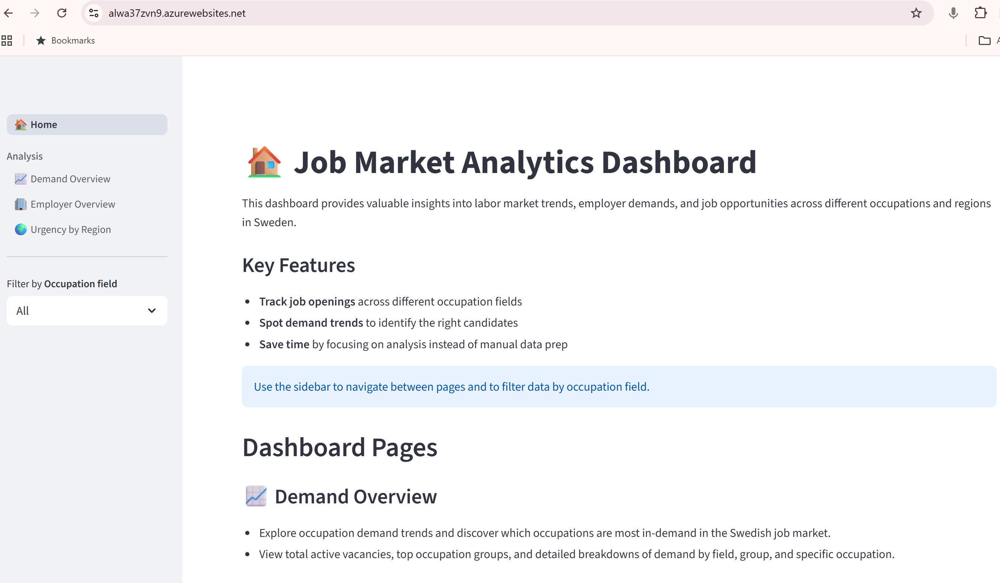
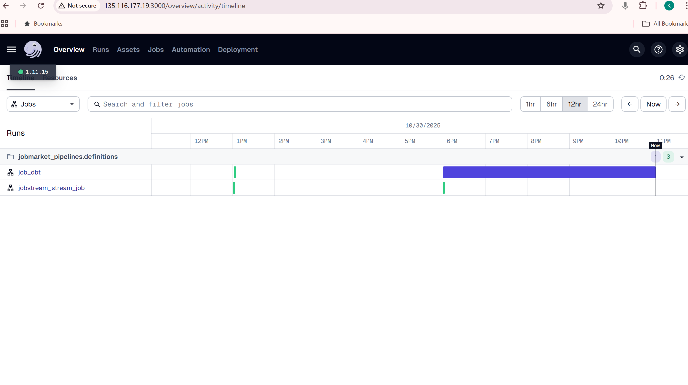
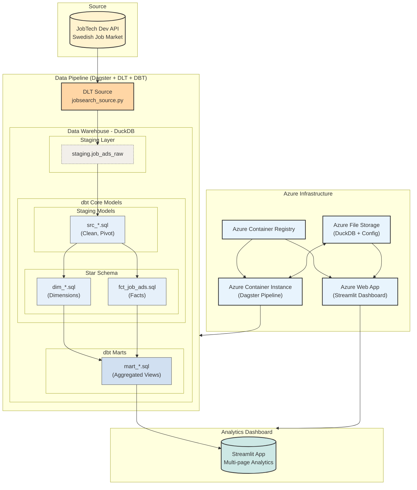

# jobsearch-hr-azure

**Modern Data Stack for Swedish Job Market Analytics**

This project implements an end-to-end data analytics platform that extracts, transforms, and visualizes Swedish job market data from Arbetsförmedlingen's JobTech API. Built for talent acquisition specialists and HR professionals to make data-driven hiring decisions.

**Created by:** Hugo Lundberg, Katrin Rylander

## 🎯 What This Platform Does

This platform transforms raw Swedish job market data into actionable insights for HR professionals and talent acquisition specialists. It automatically extracts job postings from Arbetsförmedlingen's JobTech API, processes them through a modern data pipeline that is deployed on Azure cloud infrastructure, and provides interactive analytics through a web dashboard.

**Key Capabilities:**
- **📈 Demand Analytics**: Track hiring trends by occupation, industry, and region
- **🏢 Employer Insights**: Identify top employers and recruitment patterns  
- **🌍 Geographic Analysis**: Visualize job distribution across Swedish regions
- **📊 Real-time Dashboards**: Interactive visualizations updated daily
- **🔄 Automated Pipeline**: Scheduled data extraction and transformation

## 🚀 Quick Start Guide

### Prerequisites
Before deploying, ensure you have:
- **Azure CLI** installed and authenticated (`az login`)
- **Docker** installed and running
- **Terraform** installed (v1.0+)
- **Azure subscription** with contributor permissions

### One-Command Deployment

```bash
# Deploy entire platform to Azure (takes ~10-15 minutes)
chmod +x deploy_all.sh
./deploy_all.sh
```

**What happens during deployment:**
1. ⚡ Creates Azure infrastructure (Resource Group, Container Registry, Storage)
2. 🐳 Builds and pushes Docker containers
3. 🔄 Deploys data pipeline (Dagster orchestration)
4. 📊 Deploys analytics dashboard (Streamlit web app)

### What You'll Get After Deployment

Once deployment completes, you'll have access to:

- **📊 Analytics Dashboard**: `https://<your-webapp-name>.azurewebsites.net`
  - Interactive Swedish job market insights
  - Multi-page dashboard with demand, employer, and geographic analysis
  - Real-time filtering and drill-down capabilities

Analytics Dashboard:


- **🔄 Pipeline Management**: `http://<your-container-fqdn>:3000`
  - Dagster UI for monitoring data extraction and transformation
  - Scheduled jobs running daily at 8 AM
  - Asset lineage and job execution history

Pipeline Management in Dagster:


### First Steps After Deployment
1. **Access the Dashboard**: Open the provided dashboard URL
2. **Verify Data Pipeline**: Check the Dagster UI to ensure jobs are running
3. **Explore Analytics**: Navigate through demand, employer, and geography pages
4. **Monitor Pipeline**: Data updates automatically - check back daily for new insights

## 🏗️ Architecture Overview



**Data Flow:**
1. **Extract**: Automated collection from Swedish JobTech API (daily)
2. **Transform**: Data cleaning and modeling using DBT (star schema)
3. **Load**: Analytical marts optimized for dashboard queries
4. **Visualize**: Interactive Streamlit dashboard with Swedish job market insights

## 📊 Dashboard Features

### 🎯 Key Analytics Available

**📈 Demand Overview:**
- Total active job vacancies across Sweden
- Top occupation groups and specific occupations
- Hiring trends over time with daily granularity
- Field-specific filtering (IT, Healthcare, Engineering, etc.)

**🏢 Employer Analysis:**
- Top employers by vacancy count
- Hiring patterns and recruitment trends
- Industry-specific employer insights
- Geographic distribution of employers

**🌍 Geographic Analysis:**
- Interactive maps of Swedish regions and municipalities
- Vacancy distribution by location
- Regional hiring demand visualization
- Application deadline urgency mapping

**Interactive Features:**
- **Global Filters**: Occupation field selection affects all analysis
- **Drill-down Navigation**: From broad fields to specific occupations
- **Real-time Updates**: Data refreshed daily via automated pipeline

### 📋 Manual Deployment (Alternative)

If you prefer step-by-step control:

#### **1. Foundation Infrastructure**
```bash
cd terraform/01-infrastructure
terraform init
terraform apply
```

#### **2. Build & Push Container Images**
```bash
# Pipeline container
chmod +x build_push_pipeline_image.sh
./build_push_pipeline_image.sh

# Dashboard container  
chmod +x build_push_dashboard_image.sh
./build_push_dashboard_image.sh
```

#### **3. Deploy Pipeline**
```bash
cd terraform/02-pipeline
terraform init
terraform apply
```

#### **4. Deploy Dashboard**
```bash
cd terraform/03-dashboard
terraform init
terraform apply
```

## 🔧 Troubleshooting

### Common Issues

**Deployment fails with Azure CLI errors:**
```bash
# Re-authenticate with Azure
az login
az account set --subscription "<your-subscription-id>"
```

**Container build fails:**
```bash
# Ensure Docker is running
docker --version
```

**Dashboard not loading:**
- Check Azure Web App logs in Azure Portal
- Verify container registry authentication
- Ensure file share is properly mounted

**Pipeline not running:**
- Access Dagster UI at the provided port
- Check container logs in Azure Container Instance

## 🏗️ Why This Architecture?

### ✅ **User Benefits**
- **Always Available**: Cloud-hosted dashboard accessible 24/7
- **Auto-Updates**: Fresh data without manual intervention
- **Cost-Effective**: Pay-per-use Azure services
- **Scalable**: Handles growing data volumes automatically

### ✅ **Technical Benefits**
- **Containerized Services**: Easy scaling and maintenance
- **Infrastructure as Code**: Reproducible deployments
- **Modern Data Stack**: Industry-standard tools (Dagster, DBT, DuckDB)
- **Serverless Components**: No server management required

---

## 📚 Technical Documentation

<details>
<summary>🔧 Advanced Configuration & Development</summary>

## ⚙️ Configuration Details

### 🔑 Environment Variables

**Auto-generated by Terraform:**
- `.env.pipeline`: Pipeline container configuration
- `.env.dashboard`: Dashboard container configuration  
- `.dbt/profiles.yml`: DBT connection profiles

### 🗃️ Data Storage

**DuckDB Database:** 
- **Local Development**: `data/job_ads.duckdb`
- **Azure Production**: `/mnt/data/job_ads.duckdb` (mounted from Azure File Share)

**Schemas:**
- `staging`: Raw API data loaded by DLT
- `warehouse`: Star schema (dimensions + facts) created by DBT
- `marts`: Business-ready aggregated views for dashboard

## 🛠️ Infrastructure Details

### 🏗️ Foundation Infrastructure (`terraform/01-infrastructure`)
**Purpose:** Creates core Azure resources and shared configuration

**Resources Created:**
- **Resource Group:** Container for all project resources
- **Azure Container Registry (ACR):** Private Docker image registry
- **Storage Account + File Share:** Persistent storage for DuckDB and configuration
- **Directory Structure:** Pre-creates folders in file share (`/dagster_home`, `.dbt`, `data`)
- **Configuration Files:** Generates `profiles.yml` and `.env` files

### 🔄 Pipeline Deployment (`terraform/02-pipeline`)
**Purpose:** Deploys the Dagster orchestration platform as a containerized service

**Resources Created:**
- **Azure Container Instance (ACI):** Runs Dagster webserver + daemon
- **Persistent Storage Mount:** Connects to shared file share at `/mnt`
- **Health Probes:** Liveness and readiness checks for container stability
- **Public IP + DNS:** Accessible Dagster UI at `http://<fqdn>:3000`

### 📊 Dashboard Deployment (`terraform/03-dashboard`)
**Purpose:** Deploys Streamlit analytics dashboard as a scalable web application

**Resources Created:**
- **App Service Plan:** Linux-based hosting plan (B1 SKU)
- **Azure Web App:** Container-based web application
- **Storage Mount:** Same file share mounted for DuckDB access
- **Container Registry Integration:** Pulls dashboard image from ACR

## 📦 Development Environment

### 🐳 Local Development with Docker Compose

```bash
# Start local development environment
docker-compose up --build

# Access services locally
# - Dashboard: http://localhost:8501
# - Pipeline UI: http://localhost:3000
```

### 🏗️ Dependency Management

This project uses **UV** (ultra-fast Python package manager) with **workspace configuration**:

```bash
# Install all workspace dependencies
uv sync --all-packages

# Add new dependency to specific workspace
cd dagster/  # or dbt/ or streamlit/
uv add new-package-name
```

### 🔄 Data Pipeline Details

**Dagster Assets:**
- **`dlt_load`**: Extracts job data from JobTech API using DLT source
- **`dbt_models`**: Transforms raw data using DBT models

**DBT Model Layers:**
1. **Staging** (`src_*.sql`): Raw data cleaning and normalization
2. **Warehouse** (`dim_*.sql`, `fct_*.sql`): Star schema with dimensions and facts
3. **Marts** (`mart_*.sql`): Business-ready aggregated views

**Automation:**
- **Schedule**: daily extraction at 8 AM
- **Sensor**: Auto-triggers DBT when new data arrives

</details>

<details>
<summary>📁 Project Structure</summary>

## 📁 Complete Project Structure

```
jobmarket-hr-analytics/
├── 🏗️  Infrastructure & Deployment
│   ├── terraform/
│   │   ├── 01-infrastructure/     # Core Azure resources
│   │   ├── 02-pipeline/          # Dagster pipeline deployment
│   │   └── 03-dashboard/         # Streamlit dashboard deployment
│   ├── Dockerfile.elt           # Multi-stage: Dagster + DBT pipeline
│   ├── Dockerfile.serve         # Streamlit dashboard container
│   ├── docker-compose.yaml      # Local development environment
│   ├── build_push_*.sh          # Container build & push scripts
│   └── deploy_*.sh              # Automated deployment scripts
│
├── 🔄  Data Pipeline
│   ├── dagster/                 # Orchestration & job scheduling
│   │   └── src/jobmarket_pipelines/
│   │       ├── definitions.py   # Assets, jobs, schedules
│   │       └── defs/dlt_sources/
│   │           └── jobsearch_source.py  # API extraction logic
│   └── dbt/                     # Data transformation
│       └── jobmarket_dbt/
│           ├── models/          # SQL transformation models
│           │   ├── staging/     # Raw data cleaning
│           │   ├── warehouse/   # Star schema (dims + facts)
│           │   └── marts/       # Aggregated business views
│           └── dbt_project.yml
│
├── 📊  Analytics Dashboard
│   └── streamlit/
│       └── src/jobmarket_streamlit/
│           ├── app.py           # Main application entry
│           ├── pages/           # Multi-page dashboard
│           │   ├── homepage.py
│           │   ├── page_demand.py
│           │   ├── page_employer.py
│           │   └── page_geography.py
│           └── connect_data_warehouse.py
│
├── 📦  Dependency Management
│   ├── pyproject.toml           # Root workspace configuration
│   ├── dagster/pyproject.toml   # Pipeline dependencies
│   ├── dbt/pyproject.toml       # DBT dependencies
│   └── streamlit/pyproject.toml # Dashboard dependencies
│
└── 🗂️  Data & Configuration
    ├── data/job_ads.duckdb      # Local DuckDB database
    ├── .dbt/profiles.yml        # DBT connection profiles
    └── .env.*                   # Environment configurations
```

</details>

---

**🎯 Ready to get started?** Run `./deploy_all.sh` and you'll have a live Swedish job market analytics platform in ~15 minutes!

**Questions or Issues?** Check the troubleshooting section above or review the technical documentation in the expandable sections.